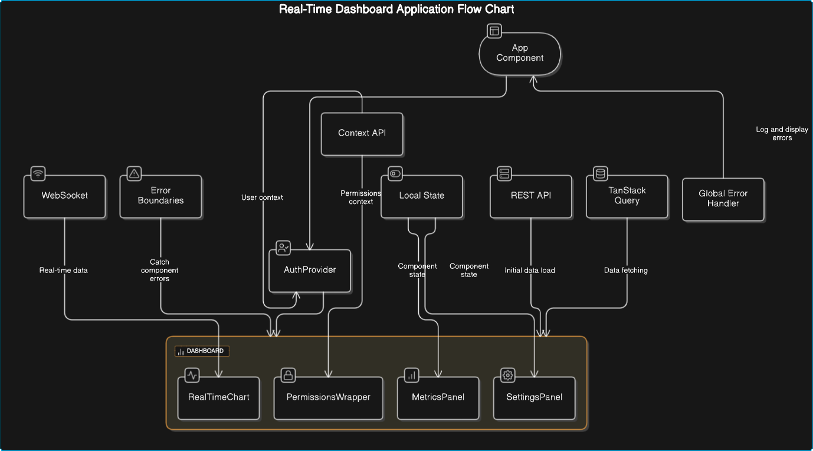

# Written Assessment (45 minutes)

Please provide thorough answers to the following questions. Include code examples where relevant.

## Technical Assessment Questions

### 1. React Server Components (RSC)
a) Explain the key differences between Server Components and Client Components in Next.js. Include specific use cases for each.
#### Server Components:  
Rendered on the server.
Do not have access to browser-specific APIs (e.g., window, document).
Can fetch data directly from the server.
Suitable for static content or content that does not require interactivity.
Example use case: Rendering a blog post or product details page.
#### Client Components:  
Rendered on the client (browser).
Have access to browser-specific APIs.
Can handle user interactions and state management.
Suitable for interactive elements and dynamic content.
Example use case: Form inputs, modals, or any component requiring user interaction.

b) How do RSCs impact application performance and bundle size?
#### Performance:  
Reduced Client-Side JavaScript: Server Components reduce the amount of JavaScript sent to the client, leading to faster initial page loads.
Improved Time to Interactive (TTI): Since less JavaScript needs to be parsed and executed on the client, the application becomes interactive more quickly.
Server-Side Rendering (SSR) Benefits: Server Components can leverage SSR benefits, such as faster data fetching and rendering on the server.
#### Bundle Size:  
Smaller Client Bundle: By offloading rendering to the server, the client bundle size is reduced, which decreases download times and improves performance.
Code Splitting: Server Components can be split and loaded only when needed, further optimizing the bundle size.

c) Describe the data fetching pattern you would implement with RSCs.
#### Server Component Fetching:  
Fetch data directly within the Server Component using server-side APIs or database queries.
Example:
```
// ServerComponent.tsx
import { getData } from '../lib/api';

export default async function ServerComponent() {
const data = await getData();
return (
<div>
<h1>{data.title}</h1>
<p>{data.content}</p>
</div>
);
}
```
#### Client Component Fetching:  
Use a Client Component for interactivity and fetch data using client-side libraries like TanStack Query.
Example:
```
// ClientComponent.tsx
import { useQuery } from '@tanstack/react-query';
import { fetchData } from '../lib/api';

function ClientComponent() {
const { data, error, isLoading } = useQuery(['data'], fetchData);

if (isLoading) return <div>Loading...</div>;
if (error) return <div>Error loading data</div>;

return (
<div>
<h1>{data.title}</h1>
<p>{data.content}</p>
</div>
);
}

export default ClientComponent;
```
#### Combining Server and Client Components:
Use Server Components for initial data fetching and rendering, and Client Components for interactivity.
Example:
```
// PageComponent.tsx
import ServerComponent from './ServerComponent';
import ClientComponent from './ClientComponent';

export default function PageComponent() {
return (
<div>
<ServerComponent />
<ClientComponent />
</div>
);
}
```

### 2. State Management & Data Fetching
a) Compare and contrast TanStack Query (formerly React Query) with traditional Redux/Context API state management. When would you choose one over the other?
#### TanStack Query:  
Focuses on data fetching, caching, synchronization, and updating server state.
Provides built-in support for caching, background updates, and synchronization.
Ideal for managing server state and asynchronous data fetching.
Reduces boilerplate code for data fetching and state management.

#### Redux/Context API:  
General-purpose state management solutions.
Suitable for managing client-side state and complex state logic.
Requires more boilerplate for data fetching and caching.
Redux is more scalable for large applications with complex state logic.

#### When to choose:  
TanStack Query: When you need efficient data fetching, caching, and synchronization with minimal boilerplate.
Redux/Context API: When you need to manage complex client-side state and business logic.

b) Explain TanStack Query's stale-while-revalidate strategy and its benefits.
#### Strategy:  
Data is considered "stale" immediately after fetching.
Allows displaying stale data while re-fetching in the background.
Ensures the UI is always responsive with the latest data.
#### Benefits:  
Improves perceived performance by showing cached data instantly.
Reduces unnecessary loading states.
Ensures data is always up-to-date with minimal user disruption.

c) How would you handle optimistic updates using TanStack Query?
Temporarily update the UI with the expected result before the server confirms the change.
Rollback if the server request fails.
Example:
```
import { useMutation, useQueryClient } from '@tanstack/react-query';
import { updateData } from '../lib/api';

function useOptimisticUpdate() {
  const queryClient = useQueryClient();

  return useMutation(updateData, {
    // Optimistically update the cache
    onMutate: async (newData) => {
      await queryClient.cancelQueries(['data']);
      const previousData = queryClient.getQueryData(['data']);
      queryClient.setQueryData(['data'], (oldData) => ({
        ...oldData,
        ...newData,
      }));
      return { previousData };
    },
    // Rollback if the mutation fails
    onError: (err, newData, context) => {
      queryClient.setQueryData(['data'], context.previousData);
    },
    // Refetch after mutation success
    onSettled: () => {
      queryClient.invalidateQueries(['data']);
    },
  });
}
```


### 3. Component Architecture
a) Describe your approach to building a reusable component library using shadcn/ui.
Identify Common Components: Start by identifying common UI elements used across the application, such as buttons, forms, modals, etc.
Create Base Components: Use shadcn/ui to create base components with consistent styling and behavior.
Abstract Logic: Abstract common logic into hooks or utility functions to keep components clean and reusable.
Document Components: Provide clear documentation and examples for each component to ensure ease of use and consistency.

b) How do you handle component composition and prop drilling in large applications?
Component Composition: Use higher-order components (HOCs) or render props to enhance components with additional functionality.
Context API: Utilize React's Context API to manage global state and avoid prop drilling. Create context providers for shared state and pass them down the component tree.
Custom Hooks: Create custom hooks to encapsulate and reuse stateful logic, reducing the need for prop drilling.

c) Explain your strategy for managing component styling and theming across a large application.
CSS-in-JS: Use a CSS-in-JS solution like styled-components or emotion to scope styles to components and avoid global CSS conflicts.
Theme Provider: Implement a theme provider using Context API to manage and switch themes dynamically.
Design Tokens: Define design tokens (e.g., colors, typography, spacing) to ensure consistency and maintainability across the application.
Modular CSS: Organize styles into modules and import them where needed to keep the codebase clean and maintainable.

### 4. Performance & Productivity
a) What metrics do you consider when optimizing a Next.js application's performance?
First Contentful Paint (FCP): Measures the time from when the page starts loading to when any part of the page's content is rendered.
Time to Interactive (TTI): Measures how long it takes for the page to become fully interactive.
Largest Contentful Paint (LCP): Measures the time it takes for the largest content element to become visible.
Cumulative Layout Shift (CLS): Measures the visual stability of the page by tracking unexpected layout shifts.
Total Blocking Time (TBT): Measures the total time that the main thread is blocked and unable to respond to user input.
Server Response Time: Measures the time taken by the server to respond to requests.

b) What tools and practices do you use to improve your daily development workflow?
Code Editors: Use advanced IDEs such as WebStorm with relevant extensions for better productivity. 
Version Control: Use Git for version control and GitHub for collaboration and code reviews. 
Linters and Formatters: Use ESLint and Prettier to maintain code quality and consistency. 
Automated Testing: Implement unit tests with Jest and integration tests with Cypress. 
Continuous Integration (CI): Use CI tools like GitHub Actions to automate testing and deployment. 
Code Snippets: Use code snippets and templates to speed up repetitive coding tasks. 
Documentation: Maintain clear and up-to-date documentation for easier onboarding and reference. 
Copilot: Utilize GitHub Copilot for AI-powered code suggestions and autocompletion to enhance coding efficiency. 
GPT: Leverage GPT-based tools for generating documentation, code explanations, and debugging assistance.

c) Share an example of a challenging debugging scenario and how your debugging toolkit helped resolve it.
A challenging debugging scenario involved a hidden infinite loop when setting and transforming data queries into URL parameters and fetching them. The issue was causing the application to make continuous requests, leading to performance degradation. Using the Chrome DevTools, I was able to:
Identify the Loop: Use the Network tab to monitor the requests and identify the pattern of continuous requests.
Analyze Call Stack: Use the Sources tab to set breakpoints and analyze the call stack to trace the origin of the loop.
Fix the Issue: Trace the problem to a piece of code that was repeatedly setting state and triggering re-renders. I used the useEffect hook with proper dependency arrays to ensure the state was only set when necessary, which resolved the infinite loop.

d) What are some common gotchas or pitfalls you've encountered when working with Next.js and React Server Components, and how do you proactively avoid them?
Component Composition: Improper component composition can lead to prop drilling and tightly coupled components.
Solution: Use Context API and custom hooks to manage state and logic.

Server-Side Only Code: Ensure that server-side code does not use browser-specific APIs like window or document.
Solution: Use conditional checks or separate server and client logic.

## System Design Scenario

Design a high-level architecture for a real-time dashboard that displays various metrics from multiple data sources. The dashboard needs to:
- Update in real-time
- Handle user authentication
- Be performance optimized
- Support different view permissions
- Be optimized for developer productivity and maintenance

Your design should include:
1. Component structure
2. Data fetching strategy
3. State management approach
4. Performance considerations
5. Error handling strategy

Provide diagrams or pseudo-code where appropriate to illustrate your design decisions.

#### High-Level Architecture for Real-Time Dashboard
1. Component Structure
   App Component: Root component that sets up routing and context providers.
   AuthProvider: Manages user authentication and provides user context.
   Dashboard: Main component that displays various metrics.
   MetricsPanel: Displays individual metric panels.
   RealTimeChart: Displays real-time data in chart form.
   SettingsPanel: Allows users to configure dashboard settings.
   PermissionsWrapper: Wraps components to enforce view permissions.
2. Data Fetching Strategy
   WebSocket: For real-time updates, establish a WebSocket connection to receive live data.
   REST API: For initial data load and non-real-time data, use REST API endpoints.
   TanStack Query: Use TanStack Query for data fetching, caching, and synchronization.
3. State Management Approach
   TanStack Query: Manage server state and handle data fetching.
   Context API: Manage global state such as user authentication and permissions.
   Local State: Use React's useState and useReducer for local component state.
4. Performance Considerations
   Code Splitting: Use dynamic imports to load components only when needed.
   Memoization: Use React.memo and useMemo to prevent unnecessary re-renders.
   Debouncing: Debounce user inputs to reduce the number of API calls.
   Lazy Loading: Lazy load heavy components and assets.
5. Error Handling Strategy
   Error Boundaries: Wrap components with error boundaries to catch and handle errors gracefully.
   TanStack Query Error Handling: Use onError callbacks to handle errors during data fetching.
   Global Error Handler: Implement a global error handler to log and display errors.



## Submission Guidelines

1. Write your answers directly in this markdown file
2. Use code blocks for any code examples
3. Include diagrams as ASCII art or links to images
4. Commit your changes to your solution branch
5. Push your changes before starting the coding assessment

## Evaluation Criteria

Your written assessment will be evaluated based on:
- Technical accuracy
- Depth of understanding
- Clarity of communication
- Real-world applicability
- Strategic thinking
- Best practices awareness